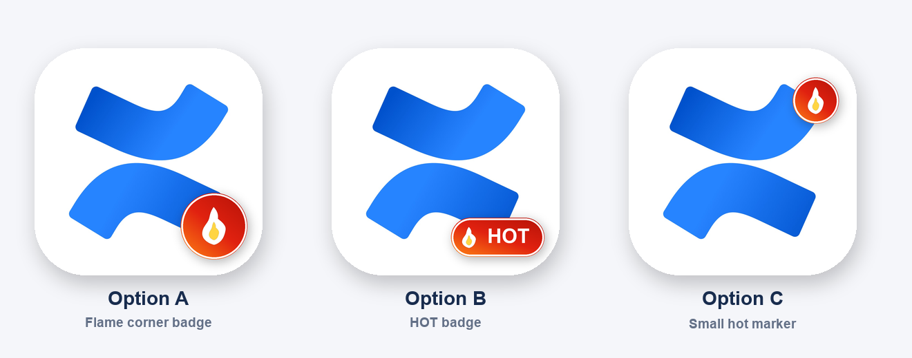

# Confluence Hot iOS


Confluence Hot iOS 是一个面向 Confluence Server / Data Center 自建站点的原生 SwiftUI 客户端。它的出发点很直接：官方 Confluence Data Center iOS App 已经很久没有明显更新，一些新的 iOS 技术、交互体验和潜在安全修复没有及时跟进，同时官方 App 也缺少“热门内容”这类很适合团队知识库的信息入口。

这个项目基于官方 App 的使用习惯重新实现了一个轻量客户端：保留熟悉的列表、空间、搜索、文章阅读体验，同时补齐热门板块、定时提醒、文章导出、横屏分栏、字体和夜间模式等能力。

> 本工程从需求拆解、界面设计、接口适配、SwiftUI 实现、图标生成、GitHub Actions 打包发布到 README，均由 Codex 完整编写和迭代。

## 为什么做

- 官方 App 风格清爽，但更新节奏较慢，难以及时应用最新平台能力。
- 自建 Confluence Data Center 场景里，团队通常更关心“最近谁在写”和“哪些内容正在被频繁阅读”。
- 官方移动端没有直接的“热门”板块，用户需要在空间、搜索或通知中绕路发现内容。
- 自建站点常有内网、私有域名、第三方部署方式，需要更直接地配置 URL、用户名和密码。
- 对知识库来说，移动端阅读体验、表格兼容、图片展示、评论回复和导出分享都很关键。

## 图标

当前图标采用 Confluence 官方图标语言，并加入代表热门内容的 `HOT` 标识，方便和官方 App 区分。

| 当前方案 | 备选预览 |
| --- | --- |
|  |  |

## 和官方 App 对比

| 能力 | Confluence Hot iOS | 官方 Confluence Data Center App |
| --- | --- | --- |
| 自建 Data Center / Server URL | 支持自定义站点 URL | 支持 |
| 用户名 / 密码登录 | 支持，密码保存到 iOS Keychain | 支持 |
| 热门内容 | 支持，优先读取 Confluence popular stream，失败时降级到 CQL | 暂无独立热门板块 |
| 最新内容 | 支持分页加载和下拉刷新 | 支持 |
| 空间浏览 | 支持空间列表和空间内内容分页 | 支持 |
| 作者搜索 | 支持按文章作者匹配 | 支持程度取决于官方搜索 |
| 内容搜索 | 支持内容匹配和关键词高亮 | 支持 |
| 搜索高亮 | 支持标题、作者、摘要关键词高亮 | 官方体验不完全一致 |
| 文章渲染 | 针对表格、图片和 Confluence storage HTML 做移动端优化 | 官方渲染能力稳定，但更新较慢 |
| 评论列表 / 回复 | 支持查看评论和添加回复 | 支持 |
| 文章操作 | 支持编辑、删除、复制链接、复制 HTML、导出单 HTML 并分享 | 官方能力更偏基础阅读协作 |
| 夜间模式 | 支持应用内开关 | 跟随官方实现 |
| 字体设置 | 支持字号调整，内置霞鹜文楷中文字体 | 暂无同类自定义 |
| 横屏分栏 | 支持 iPad / 横屏左列表右正文 | 官方体验取决于版本 |
| 热门提醒 | 支持每天 / 每周本地检查，仅提醒新的热门内容 | 暂无同类热门推送 |
| 管理员系统信息 | 支持点击后实时读取可用统计信息 | 官方移动端通常不提供 |
| GitHub Actions IPA | 支持 tag 自动发布 unsigned IPA | 不适用 |

## 主要功能

- 支持第三方自建 Confluence Server / Data Center 站点 URL、用户名和密码。
- 使用 Basic Auth 访问 Confluence REST API，密码保存在 iOS Keychain。
- “热门”优先读取 `/rest/popular/1/stream/content`，站点未启用该插件时降级到 CQL 最近活动内容。
- “最新”使用 `/rest/api/content/search` 和 CQL 分页拉取页面、博客，列表到底部自动加载更多。
- 支持高性能列表滚动、下拉刷新、分页加载和本地磁盘缓存。
- “工作”页顶部提供 bento 快捷入口：草稿箱展示所有编辑中的页面，待办保存在当前用户个人空间的私人页面中。
- 支持空间列表，进入空间后继续分页浏览该空间下的页面和博客。
- 支持作者 / 内容双栏搜索，搜索结果高亮命中的标题、作者和摘要关键词。
- 支持文章详情渲染、图片展示、表格兼容、评论列表、添加回复和跳转到 Confluence Web 页面。
- 支持文章编辑、删除、复制链接、复制 HTML、导出单个 HTML 文件并通过系统分享。
- 支持夜间模式、字号调整、霞鹜文楷字体和横屏分栏阅读。
- 支持本地热门提醒：每天或每周在系统允许的后台刷新窗口中检查新的热门内容。
- 设置页提供管理员系统信息读取入口，点击时实时读取站点系统信息和用户、页面、博客、登录审计等可用统计。

## 接口覆盖

已围绕自建 Confluence Data Center 场景验证和适配以下接口：

- `GET /rest/api/user/current`
- `GET /rest/api/content/search`
- `GET /rest/api/content/{id}`
- `PUT /rest/api/content/{id}`
- `DELETE /rest/api/content/{id}`
- `GET /rest/api/space`
- `GET /rest/popular/1/stream/content`
- `GET /rest/api/content/{id}/child/comment`
- `POST /rest/api/content`

密码不会写入仓库。请在 App 登录页手动输入站点地址、用户名和密码。

热门提醒使用 iOS Background App Refresh 和本地通知，执行时间由系统调度，不保证严格准点。当前没有配置 Apple Push Notification 服务，因此不是服务器实时推送。

## 技术栈

- SwiftUI 原生 iOS App
- Confluence REST API
- Keychain 密码保存
- URLSession 网络层
- WebView / HTML 文章渲染
- 本地磁盘缓存
- iOS BackgroundTasks / Local Notifications
- GitHub Actions macOS runner 自动构建 unsigned IPA

## 构建

用 Xcode 打开 `ConfluenceHot.xcodeproj`，选择 `ConfluenceHot` scheme 后运行到 iPhone 模拟器或真机。

本地真机调试推荐使用 Xcode 直接安装，不需要先导出 IPA：

1. 安装完整 Xcode，并打开一次完成组件安装。
2. 打开 `ConfluenceHot.xcodeproj`。
3. 在 Xcode 的 `Settings > Accounts` 添加 Apple ID，免费账号即可本机调试。
4. 选中 `ConfluenceHot` target，在 `Signing & Capabilities` 里选择你的 Personal Team。
5. 用数据线连接 iPhone，在 iPhone 上信任这台 Mac。
6. Xcode 顶部设备选择你的 iPhone，点击 Run。

免费 Apple ID 安装到真机后通常有效 7 天；付费 Apple Developer 账号可用于更稳定的真机包、Ad Hoc、TestFlight 或 App Store 分发。

## GitHub Actions 构建 IPA

仓库包含 `.github/workflows/ios-ipa.yml`。每次 push 到 `main` 或手动运行 workflow，都会在 GitHub macOS runner 上构建 unsigned IPA：

- artifact 名称：`ConfluenceHot-unsigned-ipa`
- 文件：`ConfluenceHot-unsigned.ipa`

这个 IPA 是未签名包，不能直接从 Safari 下载后安装到 iPhone。免费账号路线可以用 AltStore、SideStore、Sideloadly 等工具在本地用 Apple ID 重新签名安装。付费 Apple Developer 账号路线可以继续把证书和 provisioning profile 放进 GitHub Secrets，改成 Ad Hoc 或 TestFlight 分发。

## 发布 Release

Release 推荐用 tag 触发。推送 `v*` tag 后，GitHub Actions 会自动构建 unsigned IPA，并创建或更新对应的 GitHub Release：

```bash
git tag v1.1.5
git push origin v1.1.5
```

如果只 push 到 `main`，Actions 只生成临时 artifact，不会自动生成 Release。

## 打包资源

- App Icon 使用 Confluence 官方图标语言，并加入热门内容识别元素。
- 中文字体打包 `LXGW WenKai / 霞鹜文楷`，文件位于 `ConfluenceHot/Resources/Fonts/LXGWWenKai-Regular.ttf`。

## 说明

这个 App 是一个自建站点场景下的增强客户端，不是 Atlassian 官方产品。Confluence 及相关商标属于 Atlassian。
